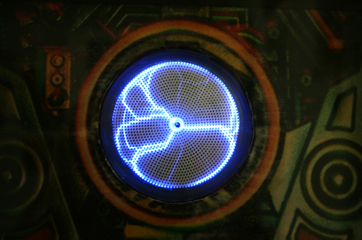

# Plasma Arc Project ⚡

Check out the live demo at [Hugging Face](https://huggingface.co/spaces/p3nGu1nZz/plasma-arc)

## Overview

The **Plasma Arc Project** aims to develop a sophisticated and efficient plasma arc simulation using WebGPU. This project leverages the power of WebGPU to achieve high-performance computations and realistic visualizations. Our goal is to create a modular, extendable, and user-friendly application for research and educational purposes.



## Features

The Plasma Arc Project is packed with features designed to make high-performance plasma arc simulation accessible and efficient for users and developers alike. Here are some of the key features:

- High-performance plasma arc simulation
- Realistic visualizations using WebGPU
- Modular and extendable codebase
- User-friendly interface
- Fast iteration with modular WebGPU components

## WebGPU Integration

WebGPU is a cutting-edge technology that provides advanced graphics and compute capabilities. By using WebGPU, our simulation can run efficiently on a wide range of devices. This section details how WebGPU is integrated into our project to achieve smoother and more responsive visualizations.

## Project Structure

Understanding the project structure is crucial for navigating and contributing to the Plasma Arc Project. Below is a breakdown of the key directories and files:

```
project-root/
├── assets/          # Assets like fonts and images
├── public/          # Static files served to client
├── src/             # Source code for javascript modules
│   ├── components/  # Reusable components
│   ├── shaders/     # Shader programs
│   ├── utils/       # Utility functions
│   ├── wgpu/        # WebGPU-specific modules
│   ├── index.js     # Main entry point for client-side application
│   ├── server.js    # Node.js server configuration
├── tests/           # Test files for the application
├── .gitattributes   # Git attributes file
├── .gitignore       # Git ignore file
├── CHANGELOG.md     # Changelog for tracking changes
├── CONTRIBUTE.md    # Guidelines for contributing
├── ETHICS.md        # Code of ethics and guidelines
├── FAQ.md           # Frequently asked questions
├── LICENSE          # License for the project
├── README.md        # Readme file
├── REFERENCE.md     # Bibiography and Links
└── SECURITY.md      # Security guidelines
```

## Installation

To get started with the Plasma Arc Project, you'll need to set up your environment by following the steps below. Ensure you have the prerequisites installed and then clone the repository to your local machine.

### Prerequisites

Before you begin, make sure you have the following software installed:

- Node.js (v14.0.0 or higher)
- Python (v3.10 or higher)
- A WebGPU-compatible browser (e.g., Chrome Canary, Firefox Nightly)

### Clone the Repository

Clone the repository to your local machine using Git:

```bash
git clone https://github.com/p3nGu1nZz/plasma-arc.git
cd plasma-arc
```

### Install Dependencies

Install the necessary dependencies using npm:

```bash
npm install
```

## Running the Simulation

Running the simulation is simple. Start the server, open the HTML file in your browser, and modify configurations as needed.

1. **Start the Server**:

   ```bash
   npm start
   ```

2. **Open `index.html`** in your WebGPU-compatible browser.

3. **Modify the Configurations** as needed in the `config` object.

4. **Refresh the Browser** to see your changes instantly with fast iterative development.

## Testing

Testing is an essential part of ensuring the stability and functionality of the Plasma Arc Project. We use Jest for testing our code.

### Run Tests

To run the tests, use the following command:

```bash
npm test
```

## Contributing

Contributions are welcome! If you'd like to contribute to the Plasma Arc Project, please follow our contribution guidelines. We appreciate all efforts to improve the project.

### Contribution Guidelines

Here are the steps to contribute:

- Fork the repository.
- Create a new branch (`git checkout -b feature-branch`).
- Make your changes.
- Commit your changes (`git commit -m 'Add some feature'`).
- Push to the branch (`git push origin feature-branch`).
- Open a pull request.

## Acknowledgments

We would like to extend our sincere gratitude to:
- **Hugging Face**: For providing an amazing platform that supports and fosters innovation.
- **Discord**: For offering a vibrant community space where collaboration thrives.
- **The Community at Hugging Face Discord**: Your feedback, discussions, and encouragement have been invaluable.
- **Microsoft Copilot**: For providing guidance and assistance throughout the development of this project.

## Alignment with Industry Standards

Our project strives to achieve parity with Unreal Engine 5 (UE5) by aligning our style guide, naming conventions, and source code architecture with industry standards. Additionally, from a design aspect, we are borrowing concepts from the state architecture of React to ensure a modern, efficient, and scalable development experience.

## License

This project is licensed under the MIT License.

## Citation

If you use this project in your research, please cite it as follows:

```bibtex
@misc{plasma_arc,
  author = {K. Rawson},
  title = {Plasma Arc},
  year = {2025},
  publisher = {GitHub},
  journal = {GitHub repository},
  howpublished = {\url{https://github.com/p3nGu1nZz/plasma-arc}},
  email = {rawsonkara@gmail.com}
}
```
